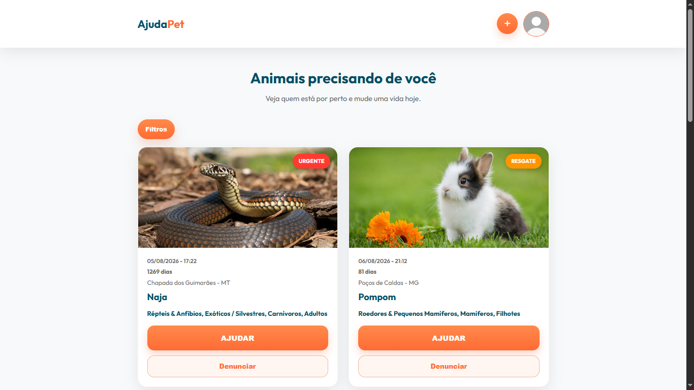
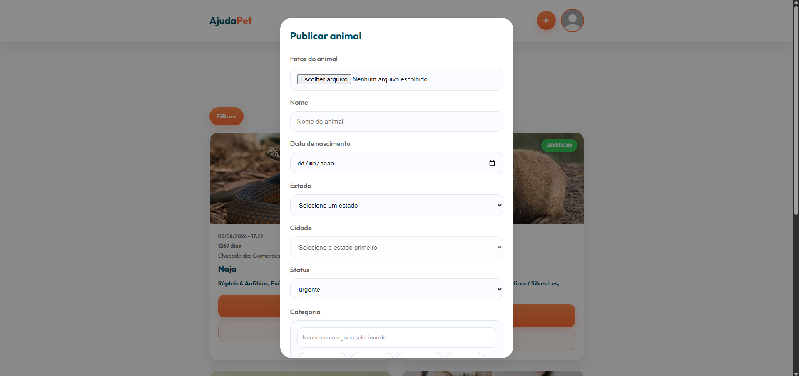
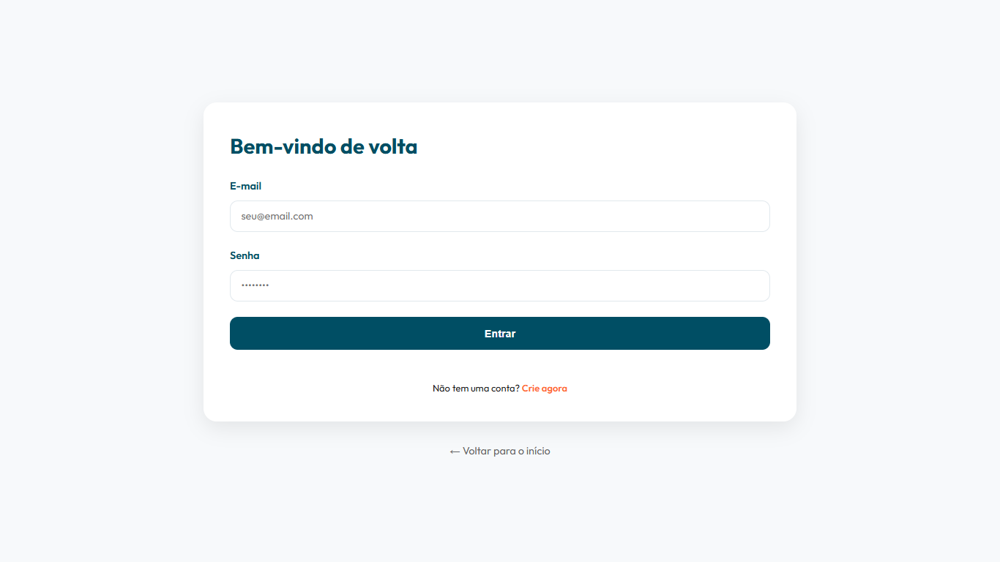

<div align="center">

# 🐾 AjudaPet

### Plataforma Web para Divulgação e Adoção de Animais

Projeto desenvolvido como trabalho escolar do curso de **Desenvolvimento de Sistemas** do **Colégio Estadual Barbosa Ferraz**.

<a href="https://ajudapet-blush.vercel.app/">🌐 Acessar Projeto</a> •
<a href="https://github.com/LucasVinicyus13/ajudapet">📁 Repositório</a>

</div>

---

# 📖 Sobre o Projeto

O **AjudaPet** é uma plataforma web criada com o objetivo de facilitar a divulgação de animais em situação de rua ou disponíveis para adoção.

A plataforma permite que qualquer usuário publique animais que necessitam de ajuda, enquanto outras pessoas podem visualizar as publicações, entrar em contato diretamente com o responsável e contribuir para que esses animais encontrem um novo lar.

O projeto busca utilizar a tecnologia como ferramenta de impacto social, aproximando pessoas interessadas em ajudar animais abandonados.

---

# 🎯 Objetivos

- Incentivar a adoção responsável.
- Facilitar a divulgação de animais em situação de risco.
- Aproximar tutores e possíveis adotantes.
- Disponibilizar uma plataforma simples, rápida e intuitiva.
- Promover o bem-estar animal através da tecnologia.

---

# ✨ Funcionalidades

- ✅ Cadastro de usuários
- ✅ Login utilizando Firebase Authentication
- ✅ Publicação de animais
- ✅ Upload de imagens
- ✅ Cadastro de informações do animal
- ✅ Contato direto via WhatsApp
- ✅ Denúncia de publicações
- ✅ Listagem de animais
- ✅ Interface responsiva
- ✅ Integração com Firebase

---

# 🖥️ Tecnologias Utilizadas

- HTML5
- CSS3
- JavaScript
- Firebase Authentication
- Firebase Firestore
- Firebase Storage
- Vercel

---

# 📷 Capturas de Tela

## Página Inicial



---

## Publicação de Animal



---

## Tela de Login



---

# 📂 Estrutura do Projeto

```text
ajudapet/
│
├── css/
├── js/
├── assets/
│
├── login/
├── cadastro/
├── pages/
│
├── index.html
└── README.md
```

---

# 🚀 Como Executar

Clone o repositório:

```bash
git clone https://github.com/LucasVinicyus13/ajudapet.git
```

Entre na pasta:

```bash
cd ajudapet
```

Abra o arquivo **index.html** em seu navegador.

Ou utilize a extensão **Live Server** no Visual Studio Code.

---

# ☁️ Hospedagem

O projeto encontra-se hospedado na plataforma **Vercel**.

**Deploy**

https://ajudapet-blush.vercel.app/

---

# 📚 Informações Acadêmicas

**Instituição**

Colégio Estadual Barbosa Ferraz

**Curso**

Desenvolvimento de Sistemas

**Turma**

3º A

**Professor Orientador**

Mateus Barbosa Reck

**Ano**

2026

---

# 👨‍💻 Desenvolvedor

**Lucas Vinicyus Sanches Anacleto**

GitHub

https://github.com/LucasVinicyus13

---

# 💡 Melhorias Futuras

- Pesquisa avançada por localização
- Sistema de favoritos
- Chat interno entre usuários
- Painel administrativo
- Histórico de adoções
- Sistema de avaliação dos adotantes
- Notificações em tempo real

---

# ❤️ Agradecimentos

Agradeço ao professor **Mateus Barbosa Reck**, ao **Colégio Estadual Barbosa Ferraz** e a todos que contribuíram para o desenvolvimento deste projeto.

---

<div align="center">

### 🐶 Adotar é um ato de amor.

Se este projeto foi útil para você, deixe uma ⭐ no repositório.

</div>
